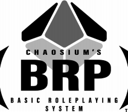

# Basic RPG System

System BASIC RPG from Chaosium par Grimmbart de Ferdock.

Cette œuvre est créée sous Licence ludique libre BRP.
Licence ludique libre BRP v 1.0 © copyright 2020 Chaosium Inc.
Basic Roleplaying © 1980—2020 Chaosium Inc. ; Auteurs, règles originales : Greg Stafford, Steve Henderson, Warren James, Steve Perrin, Sandy Petersen, Ray Turney et Lynn Willis ; développées par Jason Durall, James Lowder et Jeff Richard.
Basic Roleplaying et le logo BRP sont des marques déposées de Chaosium Inc. utilisées avec permission.

